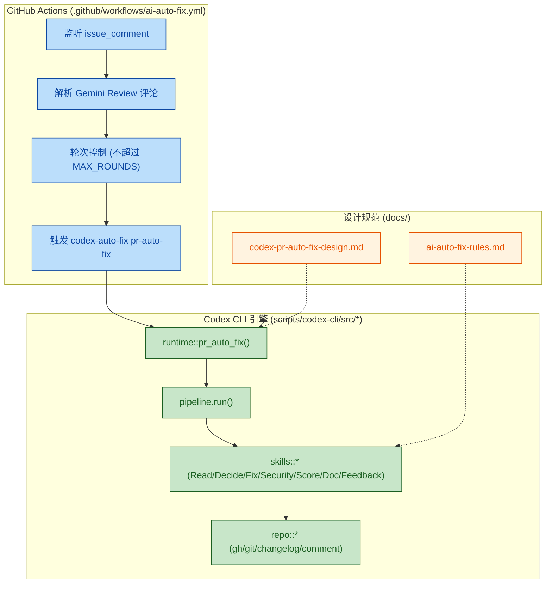

## 1. 高阶总结 (TL;DR)
* **影响程度:** [高] - 本次更新为项目引入了一套完整的「AI 自动化代码审查与修复」闭环系统。深度整合了 GitHub Actions、Gemini Code Assist 和基于本地的 Codex 执行引擎，大幅提升了 PR Review 和修复的自动化水平。
* **核心变更:**
  * ✨ **新增自动化流水线:** 创建了 `.github/workflows/ai-auto-fix.yml`，能够监听 PR 中 Gemini 机器人的评论，并自动触发本地修复任务。
  * ✨ **引入 Codex CLI 工具:** 使用 Rust 开发了 `scripts/codex-cli`（自动修复入口为 `codex-auto-fix`），用于解析 Gemini 建议、调用本地 Codex GPT-5.5 生成代码补丁并安全应用提交。
  * ✨ **制定 AI 约束规范:** 新增了自动化工作流的设计文档 (`auto-review-flow.md`) 及永久性安全约束 (`ai-auto-fix-rules.md`)，严禁修改敏感配置文件和锁文件。
  * ✨ **文档更新:** 更新了 `CHANGELOG.md`（记录了后端模块化等历史修改）及 `README.md`。

## 2. 视觉概览 (代码与逻辑流)

## 3. 详细变更分析

### ⚙️ 核心自动化引擎 (Codex CLI)
* **What Changed:** 
  * 新增基于 Rust 的 `codex-cli`。该 CLI 提供兼容入口 `codex`，并提供避免与真实 Codex CLI 冲突的自动修复入口 `codex-auto-fix`。
  * **情报解析**: `read_gemini_review()` 通过调用本地 Codex 命令将非结构化的 Markdown 评论转为包含 `severity`、`file`、`suggestion` 的结构化 JSON。
  * **安全决策**: `decide_fix_or_skip()` 实现了硬过滤规则，仅允许修复 `Medium`、`High`、`Critical` 级别问题，并自动忽略锁文件（如 `Cargo.lock`）和配置文件（如 `.env`）。
  * **补丁应用**: `generate_fix_patch()` 读取本地工作区源文件并生成 `unified diff` 格式补丁；随后 `apply_patch_safely()` 利用 `git apply` 在本地隔离环境进行安全注入，并最终由 `commit_and_push()` 提交推送。

* **依赖项变更 (Cargo.toml):**
| Package | Version | Description |
|---|---|---|
| `clap` | 4.6.1 | 命令行参数解析 |
| `tokio` | 1.52.1 | 提供异步运行时支持 |
| `serde` / `serde_json` | 1.0.228 / 1.0.149 | 结构化 JSON 的序列化与反序列化 |
| `dotenvy` | 0.15.7 | 本地环境变量及密钥加载 |

### 🔄 CI/CD 工作流 (GitHub Actions)
* **What Changed:** 
  * 引入了 `ai-auto-fix.yml`，精准监听 PR 中的 `gemini-code-assist[bot]` 评论事件。
  * **状态机设计**: 利用 PR 的 `gemini-review-round-*` 标签控制修复轮次。一旦检测到到达最大轮次（`gemini-review-round-max`），自动熔断终止执行，防止大模型陷入无限修正循环。
  * **安全注入**: 借助 GitHub Actions 的 `EOF` 语法与中间环境变量，将多行的 Review 文本安全无缝地传递给底层 CLI。

### 📄 规范、文档与历史日志
* **What Changed:**
  * 更新 `docs/README.md`，加入了关于代码审查和 AI 自动化的索引。
  * 新增 `docs/constraints/ai-auto-fix-rules.md`：建立 AI 操作红线，明确指出严禁强制推送 (`push -f`)，且自动提交必须携带 `[skip ci]` 前缀。
  * 新增架构设计与集成参考文档（`auto-review-flow.md` 等），清晰阐释了整个「双模型博弈」（Gemini 审查 + Codex GPT-5.5 修复）的工作链路。
  * 附带更新了 `CHANGELOG.md`，补充了近期关于后端配置拆分（`config.rs`）及健康检查超时机制优化的说明。

## 4. 影响与风险评估
* **破坏性变更:** 无直接代码破坏。这套纯增量式的自动化工具运行在本地 Runner 上，依赖受控的本地 Codex 命令与 runner 权限。
* **潜在风险:** 
  * ⚠️ **大模型幻觉**: `generate_fix_patch()` 返回的 `unified diff` 若上下文行号计算错误，会导致 `git apply` 拒绝合并。
  * ⚠️ **Runner 资源限制**: 在 PR 评论频繁的项目中，可能会遭遇 GitHub API 限流或本地 Codex 命令超时。
* **测试建议:**
  * **规则拦截测试**: 在 PR 中模拟针对 `package-lock.json` 或 `Low` 级别优先级的修改建议，验证 CLI 是否能够精准跳过。
  * **补丁稳定性测试**: 构造一个需要跨多行上下文修复的 Rust 代码块，验证 Codex 生成的 `diff` 能否无冲突地被 `git apply` 消化。
