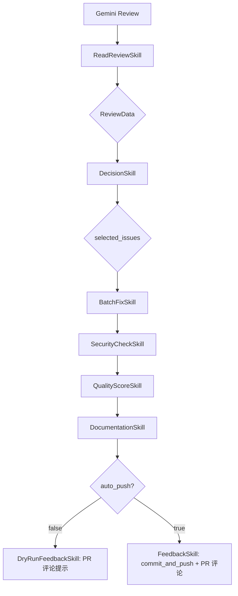

# Codex PR Auto-Fix 设计文档

## 1. 核心架构：Skill 编排
`codex pr-auto-fix` 命令采用模块化 Skill 编排架构，将复杂的修复任务拆分为多个原子级技能。

### 1.1 技能流图

## 2. 关键 Skill 定义

### 2.1 情报解析 (ReadReviewSkill)
- **职责**: 使用 GPT-5.4 将 Gemini Code Assist 的 Markdown 评论解析为结构化数据。
- **输出**: `ReviewData` 结构，包含 `summary` 和 `issues`。
- **字段**: 增加 `reason` 字段用于 Traceability，`severity` 支持 `Critical` 到 `Low`。

### 2.2 决策引擎 (DecisionSkill / decide_fix_or_skip)
- **硬过滤**: 
    - 仅处理 `Critical`, `High`, `Medium` 优先级。
    - 排除受保护文件 (`Cargo.lock`, `package-lock.json`, `.env` 等)。
    - 排除文档类路径 (`docs/`, `*.md`)。

### 2.3 批量修复 (BatchFixSkill / generate_fix_patch + apply_patch_safely)
- **隔离性**: 在本地 Harness 隔离环境中通过临时 `.patch` 文件进行 `git apply`。
- **一致性**: 确保修复代码不破坏现有架构铁律。

### 2.4 变更入档 (DocumentationSkill)
- **职责**: 将本轮自动修复的 PR 号、轮次、变更文件清单、安全扫描结果、质量评分写入 `docs/CHANGELOG.md`。
- **约束**: 写入失败应显式报错（不可静默跳过），避免“代码已改但记录缺失”。

### 2.5 Dry-Run 提示 (DryRunFeedbackSkill)
- **职责**: 当未传 `--yes`（`auto_push=false`）时，在 PR 留评论说明“已生成但未推送”，并附带文件清单/安全结果/评分。
- **目的**: 保持可追溯与可观测性，同时让“是否推送/合并”的关键决策仍由人掌控。

## 3. GitHub Workflow 集成
- **触发器**: 监听 `issue_comment` (针对 PR 评论)。
- **轮次控制**: 通过 PR 标签 (`gemini-review-round-1` 等) 实现自迭代修复，默认上限 2 轮。
- **环境安全**: 使用中间环境变量 `RAW_COMMENT_BODY` 安全注入多行情报。

## 4. 优势
- **模块化**: 每个 Skill 均可独立测试、复用。
- **确定性**: Temperature=0 + JSON Mode 确保情报解析稳定。
- **闭环**: 自动执行 Parse -> Fix -> (DryRun | Push) -> Comment 闭环流。
